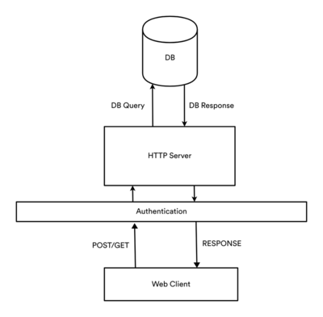
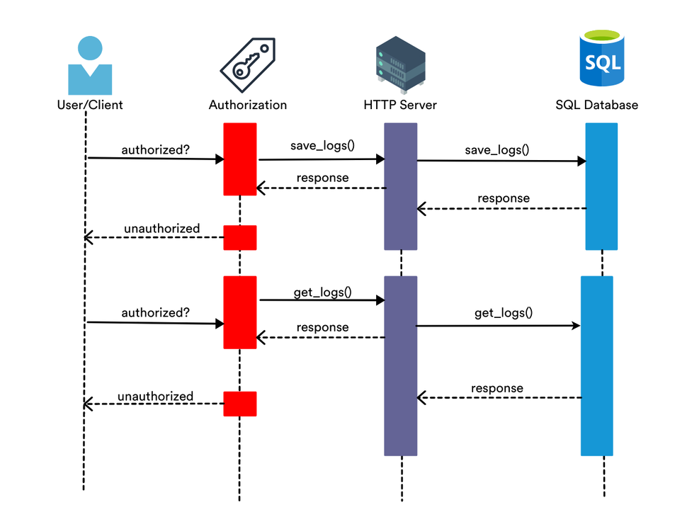

# Audit Log Service

**Audit Log Service** - Audit logging is the process of documenting activity within the software systems used across your organization. Audit logs record the occurrence of an event, the time at which it occurred, the responsible user or service, and the impacted entity[1].

## **Functional Requirements** ##

| Req Code      | Requirement                        | 
| ------------- |:----------------------------------:|
| ALS_01        | Accept data from systems           | 
| ALS_02        | Save data from other systems       |
| ALS_03        | Serve data through http endpoint   |
| ALS_04        | Authentication for all operations  | 
| ALS_05        | Deploy service as HTTP Server      |

## **Design Specifications** ##

| Req Code      | Requirement                                          | 
| ------------- |:----------------------------------------------------:|
| ALS_01        | Send data to Server through post request             | 
| ALS_02        | Save data to SQL database                            |
| ALS_03        | Serve data through http endpoint                     |
| ALS_04        | Employ Token Authentication from chosen frameworks   | 
| ALS_05        | Local Deployment                                     |

### **Framework Overview** ###

The basis overview of the server is shown below. 

The API Sequence Diagram for the log service is shown below. 

**Software and Technologies proposed for solution**

| Design Specification ID     | Solution.                                  | 
| --------------------------- |:------------------------------------------:|
| ALS_01                      | Use FLASK Web Framework                    | 
| ALS_02                      | Use SQLite Database Engine                 |
| ALS_03                      | Deploy locally through FLASK web framework |
| ALS_04                      | Flask HTTP Token Authentication            | 
| ALS_05                      | Deploy locally through FLASK web framework |

### **Flask** ###

Benefits of using Flask Web framework 

* Simple, fast and easy setup and deployment of servers. 

* Great solution for a small component of bigger systems, such as a system audit log service. 

Limitations of using Flask 

* There are better solutions for larger system web server designs e.g., Django 

* Less framework support compared to other solutions e.g, Django 

### **SQLite** ###

Benefits of Using SQLite Database Engine 

* Flexible in terms of saving data to tables. 

* Uses SQL language, which makes creating queries more smooth 

* SQLite can handle http traffic; hence it can handle a lot of read/write intensive operations during the logging and retrieving of data. 

Limitations of using SQLite Database Engine 

* Although SQLite can handle some http traffic, the storage capacity is limited if integrated into bigger systems, making it not suitable for use on the scalability front. 

To address scalability and storage issues, databases such as PostgreSQL and Oracle can be employed. 

### **SHORTCUTS** ###

On the case of events having variant and invariant event content, when saving to the database, no distinguishing mechanism is in place to save them with different specifics in the database i.e., the database saves all logs in one table as a json. 

However, when querying for specific information regarding event specific data, the program is able to search through and get all the logs associated with the event specific information. 

Alternative – an iterative solution can be employed to append field to the tables and have each field have its own column. 

## **Deployment Solution on Ubuntu** ##

The solution can only be deployed locally. To deploy the solution, please run start.sh i.e

***./start.sh***

There might be permission problems depending on the system securities, but the shell script is executable. If the script does not execute, please run,

***chmod +x start.sh*** ,

to give the file executable status.

## **Testing the solution using CURL** ##

No curl command will successfully access the server if it is not sent with Authorisation headers. The user tokens can be added in to *tokens.json*. The default tokens are saved in tokens.json, and each user can use thier predetermined token to access the server. The word "token" on the below commands is to be replaced by each user token.

* *Home Page* : curl -H "Authorization: Bearer token" http://127.0.0.1:8080
* *Save Logs* : curl -X POST -H "Authorization: Bearer token" -H "Accept: application/json" http://127.0.0.1:8080/save_logs -d "customer=michael&mail=michael@logmail.com"
* *Get Logs* : curl -X GET -H "Authorization: Bearer token" -H "Accept: application/json" http://127.0.0.1:8080/get_logs -d "customer=michael"

**References**

[1] https://www.datadoghq.com/knowledge-center/audit-logging/

